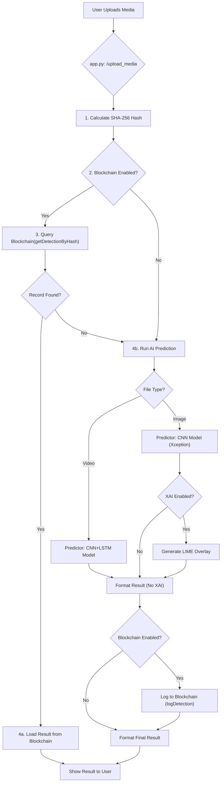

# Deepfake Media Detector (Full Application)

This is a full-stack web application for detecting deepfakes in images and videos. It features a secure user authentication system, an AI-powered detection engine (using CNNs and LSTMs), optional LIME (XAI) explainability, and immutable results-logging to an Ethereum blockchain (Ganache).

## 🚀 Key Features

  * **User Authentication:** Secure user registration and login system (Flask-Login, Bcrypt, SQLAlchemy).
  * **Dynamic UI:** A tabbed, single-page-style interface built with Tailwind CSS and Alpine.js.
      * **Upload Tab:** Allows file upload from disk or directly from a device camera.
      * **Result Tab:** Displays the most recent analysis.
      * **History Tab:** Queries and displays all past detection records from the blockchain.
      * **Terms Tab:** Shows data usage and disclaimer information.
  * **Dual AI Model:**
      * **Image (CNN):** Xception model (`xception_regularized_detector.keras`) for static image analysis.
      * **Video (CNN+LSTM):** Xception+LSTM model (`cnn_lstm_fake_detector_fully_trained.keras`) for temporal video analysis.
  * **User-Selectable Options:**
      * **Blockchain Logging:** Users can choose to log analysis results to the blockchain on a per-upload basis.
      * **Explainable AI (XAI):** Users can request a LIME heatmap for image predictions (generates an overlay).
  * **Blockchain Querying:** The app first checks the file's hash against the blockchain. If a record exists, it displays the stored result instantly, saving computation.
  * **Immutable Ledger:** Uses a Solidity smart contract (`DetectionLogger.sol`) to store file hashes, predictions, confidence scores, and XAI filenames.
  * **Automated Deployment:** Includes a Python script (`deploy_contract.py`) to compile and deploy the smart contract.
  * **Containerized:** `Dockerfile` provided for building and running the entire application.
## 📁 Architecture & Data Flow

This diagram shows the complete user flow from uploading a file to receiving a result.



## 💻 Technology Stack

  * **Backend:** Python 3.10+, Flask, Flask-SQLAlchemy, Flask-Login, Flask-Bcrypt
  * **AI / ML:** TensorFlow (Keras), OpenCV, scikit-learn, LIME, scikit-image
  * **Blockchain:** Solidity, Ganache, Web3.py, py-solc-x
  * **Frontend:** HTML5, Tailwind CSS, Alpine.js
  * **Deployment:** Docker, Gunicorn

## 📁 Project Structure

```
DeepFake-Detection/
│
├── .venv/                      # Python virtual environment
├── blockchain/
│   ├── DetectionLogger.sol     # Smart contract source code
│   ├── DetectionLoggerABI.json # Generated by deploy script
│   ├── contract_config.json    # Blockchain connection details (MUST BE FILLED)
│   ├── deploy_contract.py      # Script to deploy the contract
│   └── log_to_blockchain.py    # Script to log/query blockchain
│
├── templates/
│   └── index.html              # Main (and only) HTML file
│
├── utils/
│   └── predictor.py            # AI model loading, prediction, and XAI logic
│
├── uploads/                    # Temporary folder for uploads & XAI images
│
├── app.py                      # Main Flask application (auth, routes, API)
├── cnn_lstm_fake_detector_fully_trained.keras  # Trained video model
├── xception_regularized_detector.keras         # Trained image model
├── requirements.txt            # Python dependencies
├── Dockerfile                  # For containerization
├── .dockerignore               # To optimize Docker build
├── .gitignore                  # To secure repository
└── site.db                     # Local user database (auto-generated)
```

## 🚀 Setup & Installation (Local)

### Prerequisites

  * Python 3.10+
  * Git (for version control)
  * Ganache GUI (running on `http://127.0.0.1:7545`)
  * (Windows) `solcx` may require **Microsoft C++ Build Tools**.

### Step 1: Clone & Install Dependencies

1.  Clone this repository or download the files.
2.  Navigate to the project directory: `cd DeepFake-Detection`
3.  Create and activate a virtual environment:
    ```
    python -m venv .venv
    .\.venv\Scripts\activate  # Windows
    # source .venv/bin/activate  # macOS/Linux
    ```
4.  Install all required Python packages:
    ```
    pip install -r requirements.txt
    ```

### Step 2: Configure Blockchain

1.  **Start Ganache:** Open the Ganache GUI.
2.  **Get Account Details:** Copy a wallet `ADDRESS` and its `PRIVATE KEY` from the Ganache UI.
3.  **Update Config File:** Open `blockchain/contract_config.json` and paste your details:
    ```json
    {
      "contract_address": "",
      "network_rpc": "http://127.0.0.1:7545",
      "wallet_address": "YOUR_GANACHE_WALLET_ADDRESS",
      "private_key": "YOUR_GANACHE_PRIVATE_KEY"
    }
    ```

### Step 3: Deploy Smart Contract

1.  While in your activated virtual environment, run the deployment script:
    ```
    python blockchain/deploy_contract.py
    ```
2.  This will compile the contract, deploy it to Ganache, and automatically update `blockchain/contract_config.json` with the new `"contract_address"`.

### Step 4: Run the Application

1.  Run the Flask app. It will also create the `site.db` user database on first run.
    ```
    python app.py
    ```
2.  Open your browser and go to `http://127.0.0.1:5000`.
3.  **Register** a new user account and **Login**.
4.  Start using the application\!

## 🐳 Running with Docker

1.  **Deploy Contract:** Run **Steps 1-3** from the local setup first. You need the `contract_config.json` and `DetectionLoggerABI.json` files to be correct *before* building the image.
2.  **Configure for Container:** Open `blockchain/contract_config.json` and change `"network_rpc"` to point to Docker's host:
    ```json
    "network_rpc": "http://host.docker.internal:7545"
    ```
3.  **Build the Image:**
    ```
    docker build -t deepfake-detector .
    ```
4.  **Run the Container:**
    ```
    docker run -p 5000:5000 --name deepfake-app deepfake-detector
    ```
5.  Access the app in your browser at `http://localhost:5000`.

## 📈 Model Performance

  * **Image Model (CNN):** Trained on static frames, provides good baseline detection.
  * **Video Model (CNN+LSTM):** Trained on video sequences, achieved **\~88% validation accuracy** on a subset of the Celeb-DF dataset. However, further validation showed lower generalization (\~68% on real videos, \~41% on fakes), indicating a need for further fine-tuning or training on a more diverse dataset.

## 🔮 Future Improvements

  * **Model Fine-Tuning:** Unfreeze the top layers of the Xception base and re-train the models with a very low learning rate to improve accuracy.
  * **Fix Video Preview:** The HTML5 `<video>` tag preview currently does not render all video codecs properly (e.g., some `.mp4` files from the dataset). This could be fixed by re-encoding videos on upload or using a more robust player.
  * **Batch Processing:** Allow users to upload a batch of files for analysis.
